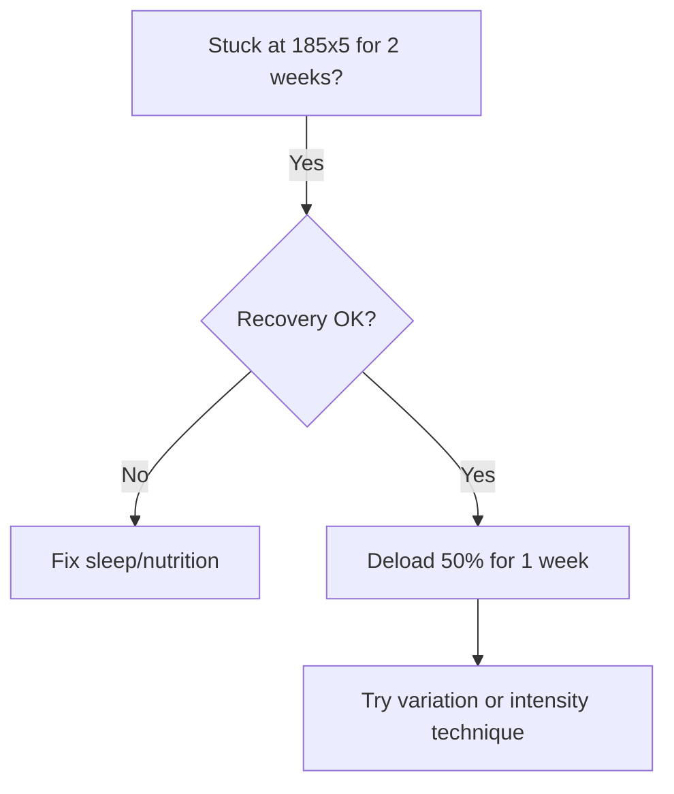
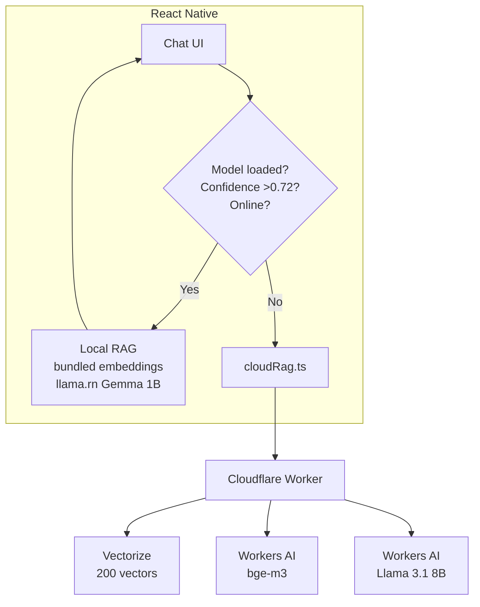

# GymTune Research Summary

**Date**: 2026-08-08  
**Research Agents**: GymSLMResearch (david-research), CloudflareAIResearch (david-research)  
**Status**: Complete

---

## Executive Summary

### 🎯 Recommended Architecture

**HYBRID APPROACH WINS**:
1. **On-device RAG** (llama.rn + Gemma 1B) for offline, privacy, speed
2. **Cloudflare Workers AI** as fallback/enhancement for better quality
3. **LoRA finetuning** for markdown/mermaid formatting (not general knowledge)
4. **Template engines** for math/charts (never trust LLM arithmetic)

**Cost**: $0-5/month for 1000 users (mostly free tier)

---

## Part 1: SLM Finetuning Research

### Key Finding: Don't Finetune Everything

❌ **Pure finetuning** of 1B model for all 5 tasks (gym advice, markdown, mermaid, charts, motivation):
- Multi-task performance drop: 1.5pp at 2B models
- Symbolic hallucination: 84-95% error rate
- Math errors: 70-83% value accuracy at best

✅ **Hybrid approach**:
- RAG for gym knowledge (retrievable facts, updatable)
- LoRA finetune for markdown/mermaid syntax (50-100 examples → 96% improvement)
- Deterministic templates for charts/math (LLM emits JSON → code computes)

### Model Recommendation

**Phase 1 (Start)**: Gemma 3 1B QAT Q4_K_M
- Size: 720 MB
- Speed: 35-45 tok/s (iPhone 17 Pro)
- Min RAM: 4GB phones
- Scores: IFEval 80.2%, GSM8k 62.8%, HumanEval 41.5%

**Phase 2 (Upgrade)**: Qwen2.5-1.5B-Instruct/Coder Q4_K_M
- Size: ~1.1 GB
- Speed: 26-35 tok/s
- Min RAM: 6GB phones
- Best for: Code→markdown/mermaid transfer
- Scores: HumanEval 46.8%, 32K context

**Premium Option**: Phi-3-mini 3.8B Q4_K_M
- Size: 2.7 GB
- Speed: 13-18 tok/s
- Min RAM: 8GB phones
- Best reasoning but 3x slower, excludes mid-range phones

### Training Data Strategy

**Total needed**: 2,000-4,000 examples (blended multi-task)

| Task | Examples | Source | Cost |
|------|----------|--------|------|
| Gym advice | 1,000-3,000 | Reddit (r/Fitness, r/weightroom) + GPT-4 synthetic | $10-20 |
| Markdown logs | 100-300 | Deterministic generator + paraphrase | $2-5 |
| Mermaid diagrams | 200-400 | mermaid.js docs + GitHub *.mmd + synthetic | $3-7 |
| Charts/tables | 200-500 | JSON extraction examples (LLM→JSON, code→volume) | $2-5 |
| **Total** | **2,000-4,000** | **Mix 40% advice, 25% markdown, 20% mermaid, 15% other** | **$20-40** |

**Key insights**:
- Synthetic data: 80-90% quality at 1/100 cost, 1/1000 time
- Must mix 10% general replay buffer (Alpaca) to avoid catastrophic forgetting
- 1,000 minimum per complex task to avoid memorization

### RAG vs Finetuning Breakdown

| Task | Approach | Why |
|------|----------|-----|
| **Gym knowledge** | RAG | Facts retrievable, needs freshness, no retrain. But sub-7B naive RAG reduces accuracy → need RAG-aware finetune |
| **Markdown syntax** | Finetune | Pattern memorization, 50-100 examples gives 96% lift |
| **Mermaid syntax** | Finetune | Syntax rules, validate with mermaid.parse |
| **Charts/Math** | Template/Tool | LLM hallucinates numbers. Emit JSON → JS computes volume/e1RM |
| **Motivation** | RAG + Prompt | System prompt defines tone, vault provides strategies |

**Result**: RAG+Finetune stacks for +6pp +5pp improvement vs either alone

### Structured Output: GBNF Grammar

**llama.cpp GBNF**:
- Grammar restricts next-token sampling
- Single-digit % overhead
- Saves retries on invalid output
- Use for: JSON workout logs, markdown table structure

**Example**:
```typescript
const grammar = LlamaGrammar.from_string(`
root ::= workout
workout ::= "## " exercise "\n" sets
exercise ::= [A-Za-z ]+
sets ::= set+
set ::= "- Set " [0-9]+ ": " weight " lbs × " reps " reps\n"
weight ::= [0-9]+
reps ::= [0-9]+
`);

const result = await context.completion({
  prompt: "Log workout...",
  grammar: grammar
});
```

### Mermaid Diagram Examples

**Recommended approach**: Template-based generation
1. LLM emits JSON intent: `{nodes: [...], edges: [...]}`
2. Deterministic `intentToMermaid()` function creates syntax
3. Validate with `mermaid.parse()` before rendering

**Useful types for GymTune**:
- `flowchart TD`: Plateau decision trees, program flows
- `gantt`: 4-week mesocycles, training schedules
- `gitGraph`: PR history timeline
- `pie`: Volume distribution by muscle group

**Example plateau flowchart**:


### Implementation Plan

**Week 1: MVP RAG-only**
- Regex parser for "Bench 185x5x3" (deterministic)
- Gemma 3 1B frozen via llama.rn
- Embeddings with MiniLM over vault chunks
- Cosine search, no finetuning yet

**Week 2: Data prep**
- Python deterministic generator for correct markdown tables
- GPT-4 paraphrase for variety
- Validate mermaid with mermaid.parse

**Week 3: Train**
- Unsloth: rank16, alpha32, dropout 0.05
- Target: q/k/v/o + gate/up/down projections
- 2 epochs, lr 2e-4, batch 4
- Shuffled mix: 40% advice, 25% markdown, 20% mermaid, 15% other
- Export LoRA adapter (20-50MB for OTA updates)

**Week 4: Integrate**
- GBNF JSON schema for extraction
- Template renderers for mermaid/charts
- Streaming tokens
- Context caching

**Week 5: Mobile**
- Test iPhone SE (4GB) + Galaxy A54 (6GB)
- Measure tok/s, memory, battery
- Gate LLM behind "Smart Parse" not keystroke
- Unload model off Coach tab
- WiFi warning for 720MB vs 2.7GB

**Week 6: Polish**
- OTA adapter updates
- Fallbacks, analytics

### Risks & Mitigations

| Risk | Mitigation |
|------|------------|
| Invalid syntax (5-10% without validation) | GBNF + mermaid.parse validation, one retry with error feedback |
| Hallucinated numbers (83% accuracy best) | Never compute in LLM, use deterministic code |
| Catastrophic forgetting | Joint shuffle + 10% replay buffer, rank 16 |
| Sub-7B RAG reduces accuracy | RAG-aware finetuning |
| Slow 3.8B inference/battery | Stick with 1B-1.5B, measure real devices |
| <1000 examples causes memorization | Hit 2K minimum, diversify sources |

---

## Part 2: Cloudflare Workers AI Research

### Key Finding: Hybrid On-Device + Cloud

❌ **Don't go all-cloud**: Kills offline capability, doubles latency, costs money  
❌ **Don't ignore cloud**: Better quality, easier updates, handles "no model" users  
✅ **Hybrid approach**: On-device first, Cloudflare as fallback

### Cloudflare Capabilities

**Workers AI**:
- Serverless GPU inference in 300+ cities
- 61 models (LLMs, embeddings, vision, audio)
- Free tier: 10,000 Neurons/day
- Paid: $0.011/1,000 Neurons

**Relevant models**:
- **Embeddings**: bge-small/base/large (384d-1024d), bge-m3 (multilingual), EmbeddingGemma
- **LLMs**: Llama 3.1 8B/70B, Gemma 3 12B, Qwen 32B, DeepSeek R1, Mistral 7B/24B
- **Cheapest for GymTune**: llama-3.2-1b ($0.027/M in, $0.201/M out)

**Vectorize**:
- Globally distributed vector database
- Up to 5M vectors per index
- Supports 384/768/1024/1536/3072 dimensions
- Cosine/euclidean/dot-product metrics
- Metadata filtering (equipment, category)

**AI Search** (formerly AutoRAG):
- Fully managed RAG: point at R2/URL, auto-chunks, embeds, indexes
- Hybrid search: BM25 keyword + vector semantic fused
- Reranking built-in
- Currently FREE in open beta
- Post-beta: $0.75/1k semantic queries (expensive at scale)

### Cost Analysis

**For 1,000 active users** (5 queries/user/day = 150k queries/mo):

**Manual Vectorize + Workers AI**:
- Vectorize: $0.65/mo (dims queried, 200 stored vectors)
- Embeddings: $0.30/mo (query embedding)
- LLM generation: $19.95/mo (llama-3.1-8b-fp8-fast)
- **Total**: ~$21/mo
- **With hybrid (20% cloud)**: ~$5-9/mo (mostly free tier)

**AI Search**:
- Queries: $111/mo (150k × $0.75/1k)
- Generation: $20/mo
- **Total**: ~$131/mo (50x more expensive)
- **Don't use at scale** - only good for crawling/MCP convenience

**Free tier survival**:
- <50 queries/day total: Entirely free
- 1000 users: Need Workers Paid ($5/mo base)

### Semantic & Fuzzy Search

**Semantic search**:
- Vectorize cosine on BGE embeddings
- bge-base 768d >> MiniLM for gym jargon
- Recall@3 >90% for 200 chunks
- Add bge-reranker for 10-15% relevance boost

**Hybrid search** (AI Search only):
- Vector + BM25 keyword in one call
- RRF fusion
- Solves pure semantic misses (e.g., "RPE" acronym)

**Fuzzy search**:
- Vectorize has NO native Levenshtein/trigram
- Semantic embeddings handle typos ("bench pres" → "bench press")
- For true fuzzy: client-side Fuse.js on metadata
- Or: LLM typo correction pre-processing

### React Native Integration

**Architecture**:
```
React Native App
    ↓ fetch
Cloudflare Worker (your auth)
    ↓ bindings
Vectorize + Workers AI + D1
```

**Example Worker** (Hono):
```typescript
import { Hono } from 'hono';

const app = new Hono<{Bindings: {AI, VECTOR_INDEX, DB}}>();

app.post('/query', async (c) => {
  const {query, topK=3, filter} = await c.req.json();
  
  // Embed query
  const emb = await c.env.AI.run('@cf/baai/bge-base-en-v1.5', {text: query});
  
  // Search vectors
  const results = await c.env.VECTOR_INDEX.query(emb.data[0], {
    topK, 
    filter, 
    returnMetadata: 'all'
  });
  
  // Generate answer
  const docs = results.matches.map(m => m.metadata.text).join('\n---\n');
  const answer = await c.env.AI.run('@cf/meta/llama-3.1-8b-instruct-fp8-fast', {
    messages: [
      {role: 'system', content: `Context:\n${docs}`},
      {role: 'user', content: query}
    ]
  });
  
  return c.json({answer: answer.response, chunks: results.matches});
});

export default app;
```

**React Native client**:
```typescript
// lib/cloudRag.ts
export async function cloudQuery(q: string, equipment?: string) {
  const res = await fetch('https://gymtune.workers.dev/query', {
    method: 'POST',
    headers: {'Content-Type': 'application/json'},
    body: JSON.stringify({query: q, topK: 3, filter: equipment ? {equipment} : undefined})
  });
  
  if (!res.ok) throw new Error(await res.text());
  return res.json();
}
```

### Hybrid Architecture



**Strategy**:
| Mode | When | Latency | Offline | Cost/1k |
|------|------|---------|---------|---------|
| Local | Offline, high confidence | 0.3-0.8s + 2-5s gen | ✅ | $0 |
| Cloud | No model, low confidence | 0.15-0.4s + 0.6-1.2s gen | ❌ | $0.14 |
| **Hybrid** | Try local, retry cloud if score <0.72 | Best of both | Graceful | ~$0.03 (20% cloud) |

### Implementation Guide

**Option A: Manual Vectorize** (Recommended)
1. `wrangler vectorize create gymtune-kb --dimensions=768`
2. Script to chunk markdown, embed, upsert
3. Deploy Worker with /query endpoint
4. RN: Local cosine first, fall back to cloudQuery()
5. Add AI Gateway for caching (1h TTL)

**Option B: AI Search** (Easiest but pricier)
1. `wrangler ai-search create gymtune-kb --source ./model/knowledge`
2. Auto-embeds, enables hybrid+reranking
3. Query via binding or REST
4. Good for: Web crawling, MCP endpoints
5. Bad for: Scale (50x more expensive)

### Comparison to Alternatives

| Service | Cost (1000 users) | Pros | Cons |
|---------|-------------------|------|------|
| **Cloudflare** | $5-21/mo | Cheapest, edge-distributed, tight integration | Vendor lock, no native fuzzy |
| **Supabase** | $27/mo | Postgres+Auth built-in, SQL joins | Single region, slower vectors |
| **Pinecone** | $70/mo | Most mature, great dashboard | 10x more expensive |
| **Pure On-Device** | $0 | 100% offline, private, zero cost | 720MB download, manual updates |

### Concrete Recommendation

**What to ship**:
1. ✅ **Keep on-device RAG** (Phase 2-3 as planned)
   - Bundle embeddings.json (384d, 0.3MB)
   - JS cosine search
   - llama.rn Gemma 1B
   - Satisfies portfolio/offline/privacy story

2. ✅ **Add Cloudflare Worker** (gymtune-rag-worker)
   - ~120 LOC: Vectorize + Workers AI + D1
   - AI Gateway caching
   - Cost <$5/mo to start

3. ✅ **Hybrid hook** `useRag(query)`:
   ```typescript
   a) Local cosine topK=3
   b) If maxScore >0.72 → return local answer
   c) Else cloudQuery() → show answer + sources
   d) Add setting: "Prefer on-device" vs "Prefer cloud"
   ```

4. ✅ **Fuzzy via Fuse.js** on client (instant suggestions)

**Avoid**:
- ❌ Cloud-only (kills offline differentiator)
- ❌ Over-engineering (200 vectors don't need Pinecone)
- ❌ Exposing Workers AI token in app

**Timeline**:
- Day 1: Create Vectorize index, ingest 20 files
- Day 2: Deploy Worker, wire RN fetch
- Day 3: Add EAS Update CI for embeddings sync

---

## Part 3: UI/UX Plan (Created)

See `docs/UI-UX-PLAN.md` for complete 23-page plan covering:

- Design system (colors, typography, spacing)
- Navigation architecture (5 bottom tabs)
- Phase-by-phase UX flows (0-5)
- 8 key screen specifications
- Component library
- Accessibility (WCAG AA)
- Portfolio showcase strategy

**Key highlights**:
- **Colors**: Blue primary (#007AFF), Green success (#34C759)
- **Nav**: Bottom tabs (Home, Progress, Coach, Friends, Settings)
- **Chat UI**: Markdown rendering, mermaid diagrams, grounding indicators
- **Onboarding**: 3-screen wizard with model download
- **Dark mode**: Pure black OLED-optimized
- **Animations**: Micro-interactions, haptics

---

## Summary: What to Build

### Phase 0-1 (Weeks 1-2) ✅ DONE
- Manual workout logging with forms
- Markdown storage
- Progress charts
- Regex natural language parser

### Phase 2 (Week 3)
- **On-device RAG**:
  - Bundle embeddings.json (384d MiniLM, 0.3MB)
  - JS cosine search over 200 chunks
  - Download Gemma 1B Q4_K_M (720MB)
  - llama.rn integration

- **Cloudflare fallback** (parallel):
  - Create Vectorize index (768d bge-base)
  - Ingest 20 knowledge files
  - Deploy Worker with /query endpoint
  - Add hybrid logic in RN

### Phase 3 (Week 4)
- **Chat UI**: Markdown + mermaid rendering
- **RAG-powered answers**: Local first, cloud fallback
- **Suggested prompts**: Example questions
- **Grounding indicators**: Show retrieved sources

### Phase 4-5 (Weeks 5-6)
- Collaboration (share/import)
- Dark mode, onboarding polish
- Micro-animations, accessibility

### Optional: LoRA Finetuning (Week 7+)
Only if RAG markdown quality <90%:
- Collect 2K training examples
- Unsloth LoRA on Qwen2.5-1.5B
- Focus on markdown/mermaid syntax only
- Export 20-50MB adapter for OTA updates

---

## Key Decisions Made

✅ **Model**: Start Gemma 3 1B, upgrade to Qwen2.5-1.5B if needed  
✅ **Approach**: Hybrid RAG + selective finetuning + templates  
✅ **Cloud**: Cloudflare Workers AI as fallback, not replacement  
✅ **Cost**: $0-5/mo for 1000 users (mostly free tier)  
✅ **UI**: Clean, portfolio-quality, accessibility-first  
✅ **Timeline**: 6 weeks to portfolio-ready v1

---

## Resources

### SLM Research Links
- ReaderLM-v2 markdown: https://arxiv.org/html/2503.01151v1
- Qwen2.5 Tech Report: https://arxiv.org/pdf/2412.15115
- RAG vs Finetuning: https://arxiv.org/abs/2401.08406
- llama.cpp GBNF: https://github.com/ggml-org/llama.cpp/grammars/
- Awesome Mobile LLM: https://github.com/stevelaskaridis/awesome-mobile-llm

### Cloudflare Links
- Workers AI docs: https://developers.cloudflare.com/workers-ai/
- Vectorize docs: https://developers.cloudflare.com/vectorize/
- AI Search docs: https://developers.cloudflare.com/ai-search/
- RAG tutorial: https://developers.cloudflare.com/workers-ai/guides/tutorials/build-a-retrieval-augmented-generation-ai/
- Example repo: https://github.com/kristianfreeman/cloudflare-retrieval-augmented-generation-example

---

**Next**: Begin Phase 2 implementation - on-device RAG + Cloudflare hybrid!
